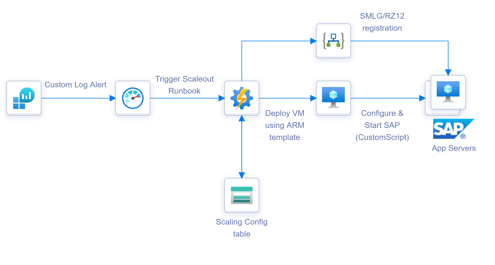

# Auto Scaling Solution
This repository provides an approach and sample code for auto scaling SAP application servers in Azure based on SAP performance metrics.  The solution is split into 2 parts

[SAP Telemetry Collection](#sap-telemetry-collection)

[SAP AutoScaling Solution](#sap-autoscaling-solution)

## SAP telemetry collection

SAP telemetry collection architecture is as shown below

## SAP AutoScaling Solution

### SAP Application Server Scale Out Architecture 

SAP work process utilization data is collected from /SDF/MON_HEADER (or /SDF/SMON_HEADER depending on what is scheduled) table using logic app and dumped to log analytics workspace. Azure monitor is then used to query the table and alert based on set thresholds. The alert triggers an automation runbook which creates new app servers using ARM templates and uses logic app to add the new SAP application server to logon groups. All config related to scaling is maintained in a table (called scalingconfig) within storage account. This includes properties of the new VM to be created, logon/server groups to be added to, max/min count for application servers etc. 

### SAP Application Server Scale in Architecture

Scale-in is achieved by means of 2 automation runbooks.  The first runbook removes the application servers from the logon/server groups using logic app and schedules the second runbook based on a delay configurable using the scalingconfig table. This helps in existing user sessions to be drained out of SAP application server to be removed. The second runbook does a soft shutdown of the application server (shutdown timeout can also be configured using the config table) and then deletes the application servers.  Trigger for the scale in would depend on customer scenarios. It can be configured using one of the following methods

 - Schedule based - Schedule scale in runbook to be executed at the end of business day everyday. 
 - Utilization based
 - Alert status

